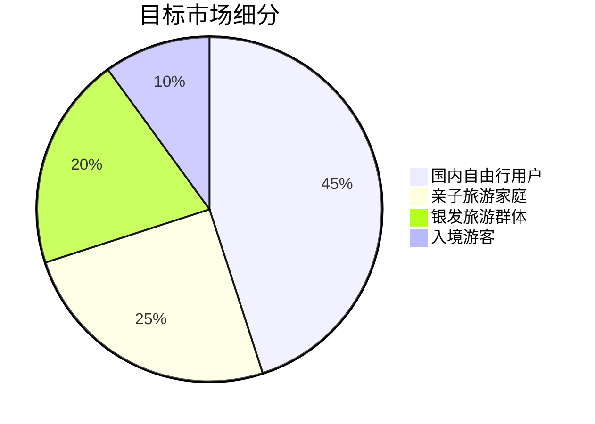
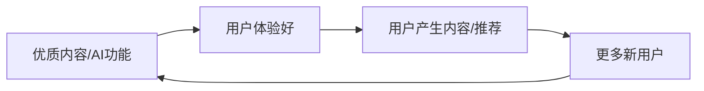
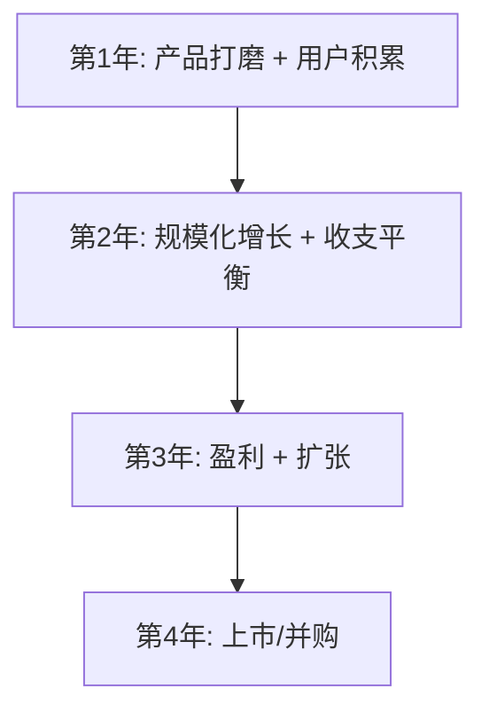

# 🌟 Local Travel App 商业计划书

<div align="center">


**智能本地旅游一站式服务平台**

</div>

---

## 目录

1. [问题与使命](#一问题与使命解决了什么问题为什么要做这家公司)
2. [产品价值](#二产品价值为什么做这个产品满足了什么痛点和刚需)
3. [目标用户](#三目标用户)
4. [市场规模](#四市场规模)
5. [为什么是现在](#五为什么是现在)
6. [为什么是我们](#六为什么是我们)
7. [营销模式](#七营销模式)
8. [商业模式](#八商业模式)

---

## 一、问题与使命：解决了什么问题？为什么要做这家公司？

### 🎯 核心问题

在中国旅游市场蓬勃发展的今天，游客面临着严重的**信息碎片化**和**体验割裂**问题：

| 问题类别 | 具体表现 | 影响 |
|---------|---------|------|
| 📱 **信息分散** | 规划用携程、导航用高德、社交用小红书、购物用淘宝 | 用户疲于切换，体验断裂 |
| 🗺️ **规划困难** | 不了解目的地，无法做出最优选择 | 错过精华景点，浪费时间金钱 |
| 👥 **孤独出行** | 独自旅行无人分享，难以找到志同道合的玩伴 | 旅行体验大打折扣 |
| 🆘 **安全隐患** | 异地求助困难，语言不通，紧急情况手足无措 | 出行安全无保障 |
| 📸 **记录缺失** | 旅途匆忙，难以留下有意义的回忆 | 多年后只剩碎片化照片 |

### 🚀 公司使命

> **"让每一次旅行都成为难忘的人生体验"**

我们立志成为**本地旅游领域的超级应用**，通过 AI + 社交 + 服务的深度融合，让用户在一个平台上完成：

- ✅ 智能规划旅行
- ✅ 找到志同道合的玩伴
- ✅ 享受专业导游服务
- ✅ 获得安全保障
- ✅ 留下珍贵回忆

### 💡 创业初心

作为一名热爱旅行的技术从业者，我深刻体会到现有旅游产品的割裂体验。我希望用技术的力量，打造一款真正**以用户为中心**的旅行伴侣应用——不仅是一个工具，更是一个懂你的旅行助手。

---

## 二、产品价值：为什么做这个产品？满足了什么痛点和刚需？

### 🔥 用户痛点分析

#### 痛点 1：旅行规划效率低

```
传统方式：花费 3-5 天研究攻略 → 行程仍不确定 → 到达后发现遗漏
我们的解决方案：AI 智能规划 → 5 分钟生成最优路线 → 实时调整建议
```

**产品功能**：
- **智能路线规划** - 基于用户偏好、时间、预算自动生成最优路线
- **AI 行程优化** - 考虑交通、天气、景点开放时间的智能调整
- **实时推荐引擎** - 根据位置和兴趣推送最佳选择

#### 痛点 2：独自旅行孤独感

```
传统方式：一个人默默拍照 → 无人分享体验 → 旅行变得乏味
我们的解决方案：智能匹配玩伴 → 实时社交互动 → 共同创造回忆
```

**产品功能**：
- **玩伴匹配系统** - 基于兴趣、年龄、性别的智能匹配
- **旅行故事圈** - 分享旅途见闻，获得真实互动
- **实时聊天** - 与同路人随时交流

#### 痛点 3：导览体验单一

```
传统方式：走马观花看景点 → 不了解历史文化 → 审美疲劳快
我们的解决方案：AI 语音导游 → 沉浸式故事讲解 → 深度理解每个景点
```

**产品功能**：
- **🗣️ AI 语音导游** - 智能语音讲解景点历史、文化、趣闻
- **📸 AI 照片日记** - 上传照片自动生成精美旅行日记
- **🧭 AR 导航** - 增强现实实景导航，永不迷路

#### 痛点 4：安全保障不足

```
传统方式：遇到紧急情况 → 不知道该联系谁 → 语言不通更焦虑
我们的解决方案：一键紧急求助 → 实时位置共享 → 多渠道救援支持
```

**产品功能**：
- **🆘 紧急求助** - 一键发送位置给紧急联系人和救援机构
- **位置实时共享** - 让家人随时了解您的位置
- **本地救援对接** - 直接联系最近的警察、医院

### 📱 核心功能矩阵

| 功能模块 | 核心功能 | 解决的痛点 |
|---------|---------|-----------|
| **智能规划** | AI 路线规划、行程优化、热门推荐 | 规划效率低 |
| **社交互动** | 玩伴匹配、故事圈、短视频、实时聊天 | 独自旅行孤独 |
| **专业服务** | 导游预约、导游咨询、评价系统 | 缺乏专业指导 |
| **AI 智能化** | 语音导游、AR 导航、AI 照片日记 | 导览体验单一 |
| **便民服务** | 门票预订、商城、优惠券、会员服务 | 消费不便捷 |
| **安全保障** | 紧急求助、位置共享、救援对接 | 安全隐患 |

---

## 三、目标用户

### 🎯 核心用户画像

#### 用户群体 1：年轻自由行用户（25-35岁）

| 属性 | 描述 |
|-----|------|
| **特征** | 上班族、时间有限、追求效率和品质 |
| **行为** | 周末短途游、年假长途游、喜欢打卡网红景点 |
| **痛点** | 规划时间少、想找同龄玩伴、希望有独特体验 |
| **规模** | 约 1.5 亿人 |

#### 用户群体 2：亲子旅游家庭（30-45岁父母）

| 属性 | 描述 |
|-----|------|
| **特征** | 有孩家庭、注重安全、乐于消费 |
| **行为** | 周末亲子活动、寒暑假亲子游；需要亲子友好的景点和服务 |
| **痛点** | 担心安全、需要便捷服务、希望孩子玩得开心又有收获 |
| **规模** | 约 1.2 亿家庭 |

#### 用户群体 3：银发旅游群体（55-70岁）

| 属性 | 描述 |
|-----|------|
| **特征** | 退休老人、时间充裕、追求舒适和安全 |
| **行为** | 错峰出行、偏好跟团但希望有自由度 |
| **痛点** | 手机操作不熟练、需要人工服务、健康安全最重要 |
| **规模** | 约 2.5 亿人（中国老龄化加速）|

#### 用户群体 4：境外来华游客

| 属性 | 描述 |
|-----|------|
| **特征** | 外籍人士、语言障碍、对中国文化好奇 |
| **行为** | 热门城市深度游、追求真实中国体验 |
| **痛点** | 语言不通、支付困难、文化理解障碍 |
| **规模** | 2025年入境游客预计突破 1.5 亿人次 |

### 📊 TAM / SAM / SOM 分析



---

## 四、市场规模

### 🌏 中国旅游市场概况

#### 市场规模（2024-2028年预测）

| 年份 | 国内旅游人次 | 国内旅游收入 | 同比增长 |
|-----|------------|------------|---------|
| 2023 | 48.91 亿人次 | 4.91 万亿元 | 恢复至 2019 年 91% |
| 2024 | 55 亿人次 | 5.5 万亿元 | +12% |
| 2025 | 62 亿人次 | 6.2 万亿元 | +13% |
| 2026 | 68 亿人次 | 6.8 万亿元 | +10% |
| 2028 | 78 亿人次 | 8.0 万亿元 | 持续增长 |

> 数据来源：中国旅游研究院、文化和旅游部

#### 在线旅游市场

| 指标 | 2024年数据 | 2028年预测 |
|-----|-----------|-----------|
| 在线旅游交易规模 | 1.3 万亿元 | 2.2 万亿元 |
| 在线渗透率 | 25% | 40% |
| 移动端占比 | 85% | 95% |

### 📈 细分市场机会

#### 1. 本地深度游市场（我们的主战场）

- **市场规模**：约 2000 亿元/年
- **年增长率**：25%+
- **特点**：疫情后"本地游"和"周边游"成为新趋势

#### 2. 旅游社交市场

- **市场规模**：约 500 亿元/年
- **年增长率**：35%+
- **特点**：Z 世代用户对社交型旅游需求强烈

#### 3. AI 智慧导览市场

- **市场规模**：约 300 亿元/年
- **年增长率**：50%+
- **特点**：AI 技术成熟，用户接受度高

### 🎯 我们的市场定位

| 市场层级 | 规模 | 说明 |
|---------|-----|------|
| **TAM（总可及市场）** | 5.5 万亿元 | 中国整体旅游市场 |
| **SAM（可服务市场）** | 2000 亿元 | 本地深度游 + 旅游社交 + 智慧导览 |
| **SOM（可获取市场）** | 50 亿元 | 首年目标：1% 市场份额 |

---

## 五、为什么是现在

### ⏰ 时机成熟的五大因素

#### 1. 📈 旅游市场强劲复苏

```
2023：国内旅游人次 48.91 亿，恢复至 2019 年 91%
2024：全面超越疫情前水平，增长势头强劲
2025：预计突破 60 亿人次大关
```

**意义**：市场需求旺盛，用户消费意愿强

#### 2. 🤖 AI 技术成熟落地

| 技术 | 成熟度 | 应用场景 |
|-----|-------|---------|
| GPT 等大语言模型 | ⭐⭐⭐⭐⭐ | AI 语音导游、智能规划 |
| 计算机视觉 | ⭐⭐⭐⭐⭐ | AI 照片分析、AR 导航 |
| 推荐算法 | ⭐⭐⭐⭐⭐ | 玩伴匹配、个性化推荐 |
| AR/VR | ⭐⭐⭐⭐ | 增强现实导航 |

**意义**：技术红利期，AI 能力可以被产品化

#### 3. 📱 移动互联网基础设施完善

- 5G 网络覆盖率：95%+
- 智能手机普及率：90%+
- 移动支付渗透率：87%+

**意义**：用户习惯已养成，产品落地无障碍

#### 4. 👤 用户代际更迭

| 用户群体 | 旅游态度变化 |
|---------|-------------|
| 90后/00后 | 追求个性化、社交化、科技化旅行体验 |
| 80后 | 家庭亲子游需求旺盛，愿意为品质付费 |
| 银发族 | 从"能省就省"到"享受生活" |

**意义**：新一代用户天然接受 AI + 社交的产品形态

#### 5. 🏆 竞争格局未定

| 竞争者 | 优势 | 劣势 |
|-------|-----|------|
| 携程/飞猪 | 品牌强、资源多 | 工具属性强、社交弱 |
| 小红书/抖音 | 内容强、社交好 | 交易弱、服务弱 |
| 高德/百度地图 | 导航专业 | 旅游场景弱 |

**意义**：市场缺乏"一站式智能旅行伴侣"，存在明确市场空白

### 🚀 窗口期判断

> **现在是进入的最佳时机**：
> - AI 技术刚刚成熟，先发者可建立壁垒
> - 旅游市场复苏井喷，用户增量巨大
> - 巨头尚未整合，创业公司有机会

---

## 六、为什么是我们

### 💪 核心竞争力

#### 1. 🎯 产品差异化定位

与其他旅游应用的对比：

| 维度 | 我们 | 携程/飞猪 | 小红书/抖音 | 高德地图 |
|-----|-----|----------|------------|---------|
| AI 智能规划 | ⭐⭐⭐⭐⭐ | ⭐⭐ | ⭐ | ⭐⭐ |
| 社交互动 | ⭐⭐⭐⭐⭐ | ⭐ | ⭐⭐⭐⭐⭐ | ⭐ |
| AI 语音导游 | ⭐⭐⭐⭐⭐ | ⭐ | ⭐ | ⭐⭐ |
| AR 导航 | ⭐⭐⭐⭐⭐ | ⭐ | ⭐ | ⭐⭐⭐ |
| 一站式服务 | ⭐⭐⭐⭐⭐ | ⭐⭐⭐⭐⭐ | ⭐⭐ | ⭐⭐ |
| 用户体验 | ⭐⭐⭐⭐⭐ | ⭐⭐⭐ | ⭐⭐⭐⭐ | ⭐⭐⭐ |

#### 2. 🛠️ 技术壁垒

**已实现的核心技术能力**：
- ✅ **AI 智能规划引擎** - 基于用户画像和偏好的智能推荐
- ✅ **AR 实景导航** - 增强现实导航系统
- ✅ **AI 语音导游** - 智能语音讲解系统
- ✅ **AI 照片日记** - 图像识别 + 文本生成
- ✅ **智能匹配算法** - 玩伴推荐引擎

**技术栈优势**：
```
前端：Next.js 15 + React 19 + TypeScript 5
移动端：Capacitor 6（跨平台）
AI：GPT 集成 + 自研模型
```

#### 3. 👥 团队优势

| 角色 | 背景 |
|-----|------|
| 创始人/技术负责人 | 全栈工程师，多年移动端开发经验 |
| 产品设计 | 深度用户研究，人性化产品设计 |
| AI 研发 | 大语言模型应用和算法优化 |

#### 4. 📈 执行力优势

**MVP 阶段已完成的功能**：

- ✅ 完整的移动端应用（Android）
- ✅ 6 大核心功能模块
- ✅ 22+ 业务服务组件
- ✅ 50+ UI 组件
- ✅ 57+ 页面/屏幕

**代码质量**：
- TypeScript 强类型保障
- 模块化架构，可维护性强
- CI/CD 自动化流程

---

## 七、营销模式

### 📢 增长策略

#### 阶段一：种子用户积累（0-10万用户）

| 策略 | 具体方式 | 预期效果 |
|-----|----------|---------|
| **KOL 合作** | 旅游博主体验测评 | 品牌曝光 + 精准获客 |
| **内容营销** | 旅行攻略、AI 体验视频 | 自然流量获取 |
| **社群运营** | 旅行爱好者社群 | 口碑传播 + 用户留存 |
| **高校推广** | 大学生旅行季活动 | 获取年轻用户种子 |

**关键指标**：
- CAC（获客成本）< 30 元
- 次日留存率 > 40%

#### 阶段二：快速增长期（10万-100万用户）

| 策略 | 具体方式 | 预期效果 |
|-----|----------|---------|
| **裂变营销** | 邀请好友得奖励 | 病毒式传播 |
| **平台合作** | 与 OTA、酒店合作 | 流量互换 |
| **线下活动** | 城市旅游主题活动 | 品牌 + 获客 |
| **信息流广告** | 抖音/小红书/微信 | 精准投放 |

**关键指标**：
- 月新增用户 > 10 万
- MAU/DAU > 0.3

#### 阶段三：规模化阶段（100万+ 用户）

| 策略 | 具体方式 | 预期效果 |
|-----|----------|---------|
| **品牌广告** | 户外广告、电视广告 | 建立品牌心智 |
| **异业合作** | 航空公司、酒店集团 | 生态整合 |
| **会员体系** | VIP 会员专属权益 | 用户付费留存 |
| **国际化** | 境外游客中国游入口 | 新增量市场 |

### 🎯 用户增长飞轮



### 💰 营销预算分配

| 渠道 | 预算占比 | ROI 预期 |
|-----|---------|---------|
| 内容营销 | 30% | 1:5 |
| 信息流广告 | 25% | 1:3 |
| KOL 合作 | 20% | 1:4 |
| 裂变活动 | 15% | 1:8 |
| 品牌广告 | 10% | 品牌价值 |

---

## 八、商业模式

### 💵 收入来源

#### 1. 🛒 交易佣金（主要收入）

| 业务类型 | 佣金比例 | 年交易规模（预测）| 预期收入 |
|---------|---------|----------------|---------|
| 门票预订 | 5-10% | 2 亿元 | 1500 万元 |
| 导游预约 | 15-20% | 5000 万元 | 800 万元 |
| 酒店/民宿 | 8-12% | 1 亿元 | 1000 万元 |
| 商城商品 | 10-15% | 3000 万元 | 400 万元 |
| **合计** | - | - | **3700 万元** |

#### 2. 👑 会员订阅（高毛利收入）

| 会员等级 | 价格 | 权益 | 预期用户数 | 收入 |
|---------|-----|------|----------|------|
| VIP 月卡 | 29 元/月 | AI 导游无限用、优惠券、优先匹配 | 5 万人 | 145 万元/月 |
| VIP 年卡 | 199 元/年 | 全部权益 + 专属客服 | 10 万人 | 1990 万元/年 |
| **年收入** | - | - | - | **~4000 万元** |

#### 3. 📣 广告收入

| 广告形式 | 展示位置 | CPM/CPC | 预期收入 |
|---------|---------|---------|---------|
| 开屏广告 | APP 启动 | CPM 50 元 | 300 万元/年 |
| 信息流广告 | 首页推荐 | CPC 2 元 | 500 万元/年 |
| 景点推广 | 规划页面 | CPC 3 元 | 400 万元/年 |
| **合计** | - | - | **1200 万元/年** |

#### 4. 🏢 B 端服务

| 服务类型 | 客户 | 定价 | 预期收入 |
|---------|-----|------|---------|
| 景区 SaaS | 景区 | 5-20 万/年 | 500 万元/年 |
| 导游工作台 | 导游 | 免费+抽佣 | 包含在交易佣金 |
| 数据服务 | 旅游局/研究机构 | 定制报价 | 200 万元/年 |

### 📊 财务预测

#### 三年财务规划

| 指标 | 第一年 | 第二年 | 第三年 |
|-----|-------|-------|-------|
| **用户规模（万）** | 50 | 200 | 500 |
| **DAU（万）** | 5 | 25 | 75 |
| **GMV（亿元）** | 1 | 5 | 15 |
| **总收入（万元）** | 3000 | 15000 | 50000 |
| **毛利率** | 65% | 70% | 75% |
| **净利率** | -30% | 5% | 15% |

#### 成本结构

| 成本项 | 第一年 | 占比 |
|-------|-------|-----|
| 人力成本 | 1500 万元 | 38% |
| 营销费用 | 1200 万元 | 31% |
| 服务器/云服务 | 500 万元 | 13% |
| AI API 成本 | 400 万元 | 10% |
| 其他运营 | 300 万元 | 8% |
| **合计** | **3900 万元** | 100% |

### 🚀 盈利路径



### 💰 融资规划

| 轮次 | 金额 | 用途 | 预期时间 |
|-----|-----|------|---------|
| 天使轮 | 500 万元 | 团队建设、产品迭代 | 2026 Q1 |
| A 轮 | 3000 万元 | 市场推广、技术升级 | 2026 Q3 |
| B 轮 | 1 亿元 | 规模化扩张、B端布局 | 2027 Q2 |

---

## 📎 附录

### 附录 A：竞品分析详情

| 维度 | Local Travel App | 携程 | 马蜂窝 | 小红书 |
|-----|-----------------|------|-------|--------|
| 定位 | 智能旅行伴侣 | OTA 平台 | 攻略社区 | 生活分享 |
| 核心功能 | AI + 社交 + 服务 | 预订 | 攻略 | 内容 |
| 变现模式 | 多元化 | 佣金 | 广告 | 广告 + 电商 |
| 用户体验 | 沉浸式 | 工具化 | 内容为主 | 社交为主 |

### 附录 B：技术架构

```
┌─────────────────────────────────────────────┐
│                  移动客户端                   │
│         (Next.js + React + Capacitor)        │
├─────────────────────────────────────────────┤
│                   API 网关                    │
├─────────────────────────────────────────────┤
│  AI 服务  │  业务服务  │  数据服务  │  第三方  │
│  (GPT等)  │  (微服务)  │  (推荐/分析) │  (地图等) │
├─────────────────────────────────────────────┤
│                   数据层                      │
│        (MySQL + Redis + Elasticsearch)       │
└─────────────────────────────────────────────┘
```

### 附录 C：已完成功能清单

- [x] 智能路线规划
- [x] AI 语音导游
- [x] AR 导航
- [x] AI 照片日记
- [x] 玩伴匹配
- [x] 旅行社交圈
- [x] 短视频分享
- [x] 导游预约
- [x] 门票预订
- [x] 商城购物
- [x] 会员体系
- [x] 钱包系统
- [x] 紧急求助
- [x] 打卡系统
- [x] 旅行日记

---

<div align="center">

## 联系我们

**Local Travel App 团队**

📧 Email: [contact@localtravelapp.com]
🔗 GitHub: [github.com/Engineer-Gu/local-travel-app](https://github.com/Engineer-Gu/local-travel-app)

---

*让每一次旅行都成为难忘的人生体验*

**© 2026 Local Travel App. All rights reserved.**

</div>
